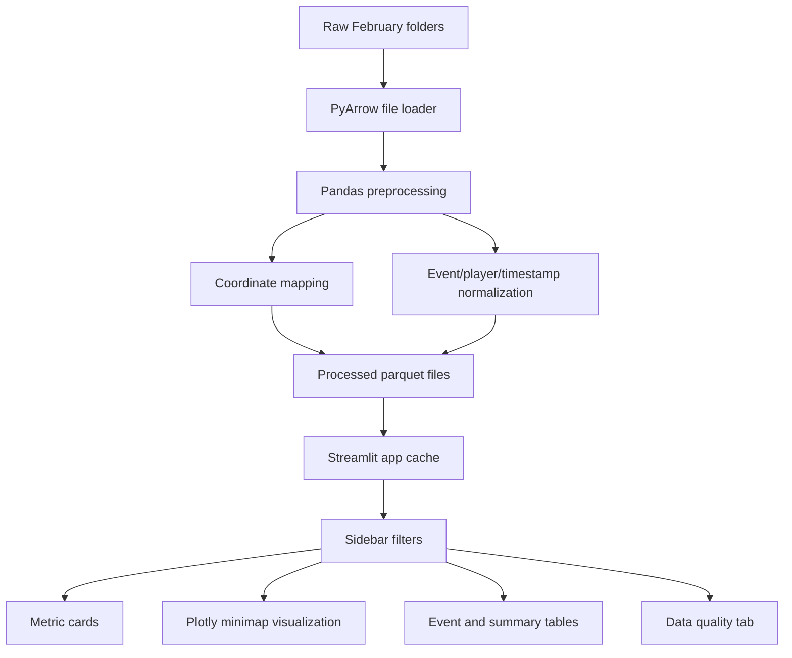

# Architecture

## What Was Built

This project is a Streamlit-based Player Journey Visualization Tool for LILA BLACK telemetry. It reads raw extensionless parquet journey files, preprocesses them into app-ready parquet tables, and renders filtered movement paths, event markers, and heatmap overlays on the correct 1024x1024 minimap.

## System Overview



## Tech Stack and Why

| Layer | Choice | Reason |
|---|---|---|
| App | Streamlit | Fast browser app, easy local run, deployable to Streamlit Cloud |
| Data loading | PyArrow | Reads parquet files even without `.parquet` extension |
| Processing | Pandas and NumPy | Simple, reliable in-memory analysis for 89,104 rows |
| Visualization | Plotly | Supports image backgrounds, paths, markers, heatmaps, legends, and hover text |
| Images | Pillow | Validates and embeds minimap images |
| Tests | Pytest | Covers coordinate mapping, event decoding, bot detection, grouping, and processed columns |

## Data Flow

1. `scripts/prepare_data.py` scans `February_10` through `February_14`.
2. `src.data_loader.read_single_file` attempts to read each journey file with PyArrow.
3. `src.preprocessing.preprocess_dataframe` decodes events, classifies humans/bots, groups events, normalizes timestamps, and adds minimap coordinates.
4. Processed outputs are saved to `data_processed/all_events.parquet`, `match_summary.parquet`, and `player_summary.parquet`.
5. `app.py` loads processed data with `st.cache_data`.
6. Sidebar filters define the active map/date/match/player/event/time scope.
7. `src.visualization.create_map_figure` renders the minimap, heatmap, player paths, and event markers.

## Coordinate Mapping

The app uses world `x` and `z` for 2D plotting. It deliberately ignores `y` because `y` is elevation.

Map configuration lives in `src/config.py`:

```text
AmbroseValley: scale=900, origin_x=-370, origin_z=-473
GrandRift:     scale=581, origin_x=-290, origin_z=-290
Lockdown:      scale=1000, origin_x=-500, origin_z=-500
```

Formula:

```text
u = (x - origin_x) / scale
v = (z - origin_z) / scale
pixel_x = u * 1024
pixel_y = (1 - v) * 1024
```

`pixel_y` is flipped because image origin is top-left. The app stores `u`, `v`, `pixel_x`, `pixel_y`, `in_minimap_bounds`, and clipped plotting coordinates. The documented AmbroseValley sample `x=-301.45, z=-355.55` maps to approximately `pixel_x=78, pixel_y=890`; this is covered by `tests/test_coordinate_mapping.py`.

## Timestamp Handling

The raw `ts` field is elapsed match time encoded as a timestamp. It can look like a 1970 wall-clock timestamp, but the app does not treat it as a calendar date. The pipeline converts timestamps to milliseconds, subtracts the earliest timestamp in each `match_id`, and writes `match_time_s` plus `match_time_label`.

This export has compact sub-second match spans after millisecond normalization, so the UI supports fractional-second timeline sliders.

## Human vs Bot Detection

Human and bot detection is based on `user_id`, not event name:

- Numeric `user_id`: Bot
- UUID-like `user_id`: Human

This creates `is_bot` and `player_type`, which drive filters, metrics, path styling, and table fields.

## Event Classification

| Raw event | Group | Used for |
|---|---|---|
| `Position` | Movement | Human paths and traffic heatmap |
| `BotPosition` | Movement | Bot paths and traffic heatmap |
| `Kill` | Kill | Kill markers and kill heatmap |
| `BotKill` | Kill | Kill markers and kill heatmap |
| `Killed` | Death | Death markers and death heatmap |
| `BotKilled` | Death | Death markers and death heatmap |
| `KilledByStorm` | Storm | Storm marker and storm heatmap |
| `Loot` | Loot | Loot marker and loot heatmap |

Unknown events are retained and flagged with `unknown_event`.

## Tradeoffs

| Decision | Benefit | Tradeoff |
|---|---|---|
| Streamlit single app | Easy to run, review, and deploy | Less custom UI than React |
| Processed parquet cache | Fast app startup after preparation | Requires generated files or first-run processing |
| No individual paths in all-match view | Keeps aggregate maps readable | Aggregate route shape is shown through heatmaps |
| Manual timeline slider | Reliable and testable | No automatic playback loop |
| Row-density heatmaps | Simple and transparent | Does not deduplicate by player |

## Assumptions

- Raw folders and minimaps stay relative to the project root.
- Each file represents one player or bot journey in one match.
- Full `match_id` values are preserved.
- The minimap images are 1024x1024 pixels.
- February 14 is a partial day and is not scaled up.

