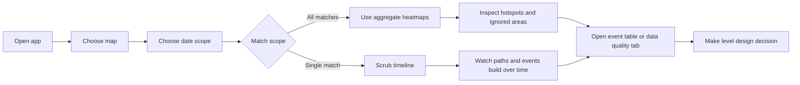
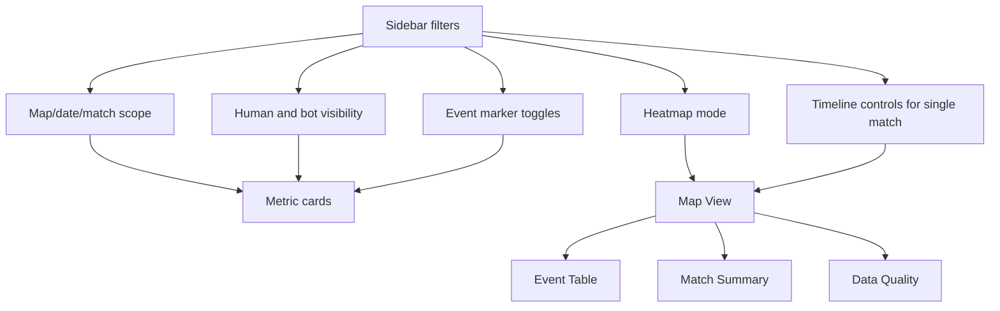

# Product Approach

## Product Goal

The goal is to give a Level Designer a fast, visual way to understand how LILA BLACK matches unfold. Instead of asking the reviewer to open parquet files or write analysis code, the tool turns five days of production telemetry into a map-first workflow: pick a map, choose the scope, inspect movement, then drill into combat, deaths, loot, storm pressure, and raw event rows when needed.

This is built as an assessment submission, but the product shape is intentionally close to a real internal design tool.

## Target User

The main user is a Level Designer. They are not trying to debug parquet files. They are asking practical design questions:

- Where are humans and bots actually moving?
- Which lanes are used heavily?
- Which areas are ignored?
- Where do kills and deaths cluster?
- Are loot areas creating the intended risk/reward?
- Are storm deaths happening in readable places?
- How does one match unfold over time?

## Core Workflow

## Information Architecture

## Product Principles

- Visual first: the minimap is the main surface because the design question is spatial.
- Fast filtering: map, date, and match filters cascade so the designer can narrow the dataset without hunting.
- Clear player distinction: humans and bots are visibly different because AI routes can hide or distort player behavior.
- Event clarity: kills, deaths, loot, and storm deaths use separate marker styles so the map remains readable.
- Aggregate plus detail: all-match heatmaps show broad patterns, while single-match timeline controls show moment-to-moment flow.
- Honest data: the app reports missing coordinates, out-of-bounds rows, unknown events, loaded files, and failed files.

## Feature Coverage

| Feature | Product reason | Where it appears |
|---|---|---|
| Map filter | Designers usually think map-first | Sidebar |
| Date filter with All dates | Compare one day or the full sample | Sidebar |
| Match filter with All matches | Switch between aggregate analysis and single-match review | Sidebar |
| Human/bot toggles | Separate real player behavior from AI traffic | Sidebar and legend |
| Event toggles | Reduce clutter when focusing on one question | Sidebar |
| Traffic heatmap | Find high-use lanes and crowded areas | Map View |
| Kill/death/storm/loot heatmaps | Find event-specific hotspots | Map View |
| Human and bot paths | Reconstruct journeys in a match | Map View |
| Timeline slider | See how a selected match unfolds | Sidebar and Map View |
| Full-path toggle | Keep context while scrubbing time | Sidebar |
| Recent time window | Focus on the latest 30/60/120 seconds | Sidebar |
| Metric cards | Give quick counts for the active scope | Top of app |
| Event table | Let reviewers verify exact rows behind a visual pattern | Event Table tab |
| CSV download | Allow follow-up analysis outside the app | Event Table tab |
| Match summary | Summarize duration, players, combat, loot, and storm events | Match Summary tab |
| Data quality tab | Make trust and telemetry limitations visible | Data Quality tab |

## UX Choices

The app opens directly into the working dashboard. There is no landing page because the evaluator and target user both need the tool, not marketing copy.

The sidebar owns filtering and layer controls. The center of the page stays focused on the minimap. Metric cards sit above the map so the designer gets quick context before reading the visualization.

Human paths are solid blue and bot paths are dashed orange. This makes bots visible without letting them visually dominate the map. Markers follow a simple design language: red stars for kills, dark X marks for deaths, purple diamonds for storm deaths, and green circles for loot.

## What Was Intentionally Left Out

- Automatic play/pause animation. Streamlit reruns make a true animation loop less reliable than a deterministic slider for this submission.
- Player display names. The dataset only includes IDs.
- Squad/team reconstruction. No team field is present.
- Objective or extraction overlays. Those design assets are not included.
- A separate backend service. The dataset fits in memory, and Streamlit keeps the project easy to run and deploy.

## Future Improvements

- Add optional animation playback after choosing a stable Streamlit timer pattern.
- Add route clustering to summarize common paths.
- Add extraction and storm-direction overlays if those design references become available.
- Add side-by-side map comparison.
- Add per-player selection and a focused journey view.
- Add jump-detection checks for impossible movement spikes.

