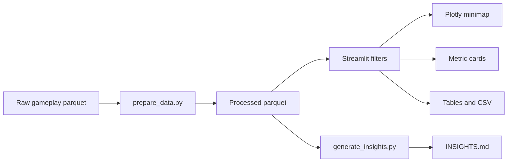

# LILA BLACK Player Journey Visualizer

GitHub repo: https://github.com/DEEKSHAPAL/lila_product-assignment

Deployed app: https://lilaappuct-assignment-nc4g2rh8ul5vwyskhnexjc.streamlit.app/

Vercel landing page: https://lila-product-assignment-sswh.vercel.app/

Important: the Streamlit URL is the interactive dashboard. The Vercel URL is a small landing page with only the GitHub and dashboard links.

This project is a browser-based telemetry visualization tool for the LILA APM written test. It loads five days of LILA BLACK player and bot journey parquet files, maps world x/z coordinates onto the provided minimaps, and helps Level Designers inspect movement routes, combat hotspots, death locations, storm deaths, loot pickups, and match flow.

## How the Tool Flows



In normal use, a reviewer opens the app, chooses a map, then decides whether to look at all matches as a heatmap or one match as a timeline. The map stays central because the main question is spatial: where are players going, fighting, looting, dying, or getting caught by storm?

## Features

- Streamlit dashboard with map, date, match, player visibility, event, heatmap, and timeline filters.
- Correct minimap rendering for AmbroseValley, GrandRift, and Lockdown.
- Human and bot paths styled differently: humans use solid blue paths; bots use dashed orange paths.
- Distinct event markers for kills, deaths, storm deaths, and loot with detailed hover text.
- Match timeline slider with elapsed time display, full-path toggle, and recent time-window controls.
- Aggregate and single-match heatmaps for traffic, kills, deaths, storm deaths, and loot.
- Metric cards, match summary tables, data quality checks, and filtered CSV download.
- Processing scripts that decode event bytes, classify bots, normalize elapsed match time, and save processed parquet files.
- Evidence-backed `INSIGHTS.md` generated from the actual dataset.

## Tech Stack

- Python
- Streamlit
- Pandas
- PyArrow
- NumPy
- Plotly
- Pillow
- DuckDB
- Pytest

## Folder Structure

```text
.
|-- app.py
|-- requirements.txt
|-- vercel.json
|-- README.md
|-- ARCHITECTURE.md
|-- INSIGHTS.md
|-- PRODUCT_APPROACH.md
|-- TECH_APPROACH.md
|-- SYSTEM_DESIGN.md
|-- DEPLOYMENT.md
|-- FINAL_AUDIT.md
|-- SUBMISSION_CHECKLIST.md
|-- .gitignore
|-- public/
|   `-- index.html
|-- .streamlit/
|   `-- config.toml
|-- src/
|   |-- __init__.py
|   |-- config.py
|   |-- coordinate_mapping.py
|   |-- data_loader.py
|   |-- preprocessing.py
|   |-- visualization.py
|   |-- insights.py
|   `-- utils.py
|-- scripts/
|   |-- inspect_data.py
|   |-- prepare_data.py
|   `-- generate_insights.py
|-- tests/
|   |-- test_coordinate_mapping.py
|   `-- test_data_processing.py
|-- data_processed/
|   |-- all_events.parquet
|   |-- match_summary.parquet
|   `-- player_summary.parquet
|-- February_10/
|-- February_11/
|-- February_12/
|-- February_13/
|-- February_14/
`-- minimaps/
```

## Local Setup on Windows PowerShell

```powershell
python -m venv .venv
.\.venv\Scripts\Activate.ps1
pip install -r requirements.txt
python scripts\prepare_data.py
python scripts\generate_insights.py
streamlit run app.py
```

The app also attempts to process data automatically if `data_processed/all_events.parquet` is missing, but running `prepare_data.py` first gives clearer console output.

## Testing

```powershell
python scripts\inspect_data.py
python scripts\prepare_data.py
python scripts\generate_insights.py
python -m pytest tests -q
python -m py_compile app.py
streamlit run app.py
```

For the Streamlit smoke test, confirm the terminal prints a local URL and does not raise startup errors.

## Data Assumptions

- Raw files live in `February_10` through `February_14`.
- Raw gameplay files have no `.parquet` extension, but are valid parquet files.
- `event` values may be bytes and are decoded as UTF-8.
- `x` and `z` are used for 2D minimap plotting. `y` is elevation and is not used for map placement.
- `ts` is elapsed match time encoded as a timestamp, so the pipeline computes seconds from each match's earliest timestamp.
- Numeric `user_id` values are bots. UUID-style values are humans.
- Points outside the 1024x1024 minimap bounds are retained in the data and clipped for plotting.

## How to Use the App

1. Choose a map in the sidebar.
2. Optionally narrow to a date folder.
3. Select `All matches` for aggregate heatmaps or a specific match for player paths and timeline playback.
4. Toggle humans, bots, and event marker groups.
5. Pick a heatmap overlay to inspect traffic or event density.
6. For a single match, move the timeline slider to inspect how the match unfolds.
7. Use the Event Table tab to review and download filtered rows.
8. Use Data Quality to inspect out-of-bounds points, unknown events, and minimap file status.

## Documentation

- [Architecture](ARCHITECTURE.md)
- [Insights](INSIGHTS.md)
- [Product Approach](PRODUCT_APPROACH.md)
- [Technical Approach](TECH_APPROACH.md)
- [System Design](SYSTEM_DESIGN.md)
- [Deployment Guide](DEPLOYMENT.md)
- [Final Audit](FINAL_AUDIT.md)
- [Submission Checklist](SUBMISSION_CHECKLIST.md)

## Deployment on Streamlit Community Cloud

1. Push the project to a GitHub repository with `app.py`, `requirements.txt`, `src/`, `scripts/`, `minimaps/`, the raw February folders, and preferably `data_processed/`.
2. In Streamlit Community Cloud, create a new app from the repository.
3. Set the main file path to `app.py`.
4. Let Streamlit install packages from `requirements.txt`.
5. Open the deployed app and verify map filters, timeline, markers, heatmaps, and CSV download.
6. Keep the deployed URL above updated if the Streamlit app is redeployed under a different URL.

## Vercel Deployment

This repo includes a complete `vercel.json` so Vercel can deploy automatically from GitHub. Because this project is a Streamlit app, Vercel serves a minimal static landing page from `public/index.html`. The Vercel page is not the interactive app; it links reviewers to the live Streamlit dashboard and GitHub repo.

Why this split exists: Streamlit needs a live server connection for the browser UI, while Vercel Functions do not support acting as a WebSocket server. A Vercel deploy is still useful as a project landing page, but the actual playable dashboard should be deployed with Streamlit.

To deploy the landing page on Vercel:

1. Import `https://github.com/DEEKSHAPAL/lila_product-assignment` into Vercel.
2. Keep the default root directory.
3. Vercel will read `vercel.json` and publish `public/index.html`.
4. If the Streamlit app URL changes, update the deployed app URL in this README and `public/index.html`.

The raw data appears to be assessment data and may be larger than a normal code-only repo. Keep the repository private unless the assignment explicitly allows publishing the files.
