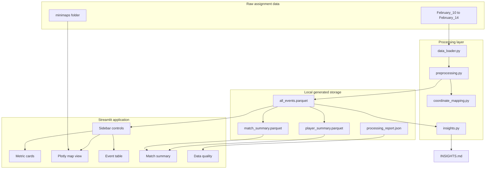
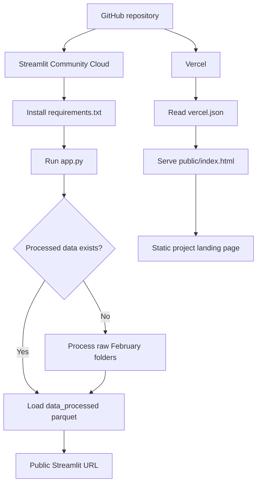

# System Design

## System Purpose

The system turns raw LILA BLACK gameplay telemetry into a browser-based map analysis tool. The design keeps the data pipeline, visualization logic, and app UI in one Python project so it is easy to review, run locally, and deploy for the written test.

## High-Level Design

## Main Components

| Component | Responsibility |
|---|---|
| `src/config.py` | Map configs, known events, event groups, heatmap event definitions |
| `src/data_loader.py` | Find raw files, read extensionless parquet, load/save processed data |
| `src/preprocessing.py` | Decode events, classify players/events, normalize timestamps, create summaries |
| `src/coordinate_mapping.py` | Convert world x/z coordinates into minimap pixels |
| `src/visualization.py` | Build Plotly minimap, heatmap, paths, markers, and hover text |
| `src/insights.py` | Compute grid hotspots and write evidence-backed insights |
| `app.py` | Streamlit layout, filters, timeline, metrics, tabs, CSV download |
| `scripts/` | Repeatable inspection, preparation, and insight generation commands |
| `tests/` | Unit and smoke checks for the most fragile logic |

## User-Facing Feature Map

## Data Model

The main processed table is `data_processed/all_events.parquet`. Important columns include:

| Column | Meaning |
|---|---|
| `user_id`, `match_id`, `map_id` | Core identity fields |
| `source_date`, `source_file` | Raw file provenance |
| `x`, `y`, `z` | World coordinates, with `y` kept as elevation only |
| `event` | Decoded event string |
| `is_bot`, `player_type` | Human/bot classification |
| `event_group`, `event_category`, `event_display` | UI-friendly event taxonomy |
| `ts_raw`, `ts_ms`, `match_time_s`, `match_time_label` | Timeline fields |
| `u`, `v`, `pixel_x`, `pixel_y`, `in_minimap_bounds` | Minimap mapping fields |
| `plot_pixel_x`, `plot_pixel_y` | Clipped plotting coordinates |

## Deployment Shape

The Streamlit Cloud path is the production path for the interactive dashboard. The Vercel path is a static landing page because Vercel's serverless function model is not a good runtime for Streamlit's live browser connection.

## Failure Handling

- If a raw parquet file cannot be read, it is skipped and recorded in the processing report.
- If processed parquet is missing, the app attempts to process raw data automatically.
- If filters produce no rows, the app shows a warning instead of failing.
- If a minimap is missing, the visualization reports the missing image path.
- If unknown events appear, they are grouped as `Other` and counted in Data Quality.

## Why This Design Works for the Assignment

The assignment rewards end-to-end execution, correct coordinate mapping, clear visual analysis, and evidence-backed insights. This design keeps those concerns separated:

- Data correctness lives in preprocessing and tests.
- Spatial correctness lives in coordinate mapping.
- Product behavior lives in Streamlit filters and tabs.
- Visual clarity lives in Plotly layer ordering and marker styles.
- Evidence lives in generated insights and processed data summaries.
