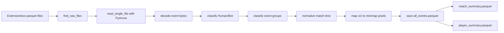
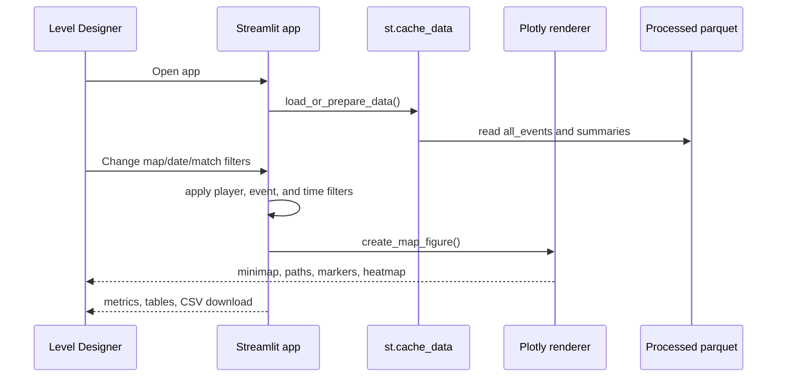

# Technical Approach

## Stack

The implementation uses Python, Streamlit, Pandas, PyArrow, NumPy, Plotly, Pillow, DuckDB, and Pytest. DuckDB is included for future SQL-style exploration, but the current pipeline uses Pandas because the dataset is small enough to fit comfortably in memory.

## Why Streamlit

Streamlit is the right fit for this assignment because the product is a data exploration tool, not a consumer web app. It lets the same Python project handle parquet loading, preprocessing, analysis, visualization, testing, and deployment. A React frontend plus backend would add ceremony without improving the core review workflow.

## Processing Pipeline



Important processing choices:

- Files are read by path, not by extension.
- `source_date` and `source_file` are added during load.
- `event` bytes are decoded safely to clean strings.
- `y` is preserved in the table but never used for minimap plotting.
- `match_time_s` is computed relative to each match's first timestamp.
- `in_minimap_bounds` is stored so plotting and data quality can be separated.

## Runtime Flow



## Visualization Technique

Plotly renders the minimap as a layout image under all telemetry traces. Heatmaps are added first, player paths second, and event markers last. The x-axis is `0..1024`, the y-axis is `1024..0`, and the y-axis is anchored to x so the image is not stretched or mirrored.

Visual encodings:

- Human path: solid blue line
- Bot path: dashed orange line
- Kill: red star
- Death: dark X
- Storm death: purple diamond
- Loot: green circle

Hover text includes player id, player type, event, match time, world x/z, pixel x/y, map, and match id.

## Heatmap Approach

Heatmaps use `numpy.histogram2d` over in-bounds minimap pixels:

| Heatmap mode | Source events |
|---|---|
| Traffic | `Position`, `BotPosition` |
| Kills | `Kill`, `BotKill` |
| Deaths | `Killed`, `BotKilled` |
| Storm Deaths | `KilledByStorm` |
| Loot | `Loot` |

The opacity is set low enough that the minimap remains readable underneath.

## Timeline Approach

The timeline appears only for a single selected match. The slider runs from 0 to that match's duration. Metrics and markers update up to the selected time. Designers can either keep the full path visible for context or show only the elapsed/recent window.

Automatic play/pause was intentionally not implemented because Streamlit reruns make a true animation loop less predictable than a slider in this context.

## Performance Considerations

- Processed parquet files avoid rereading raw files on every app load.
- `st.cache_data` keeps loaded data in memory across reruns.
- All-match views suppress individual paths and favor heatmaps to avoid thousands of traces.
- Single-match paths are capped by top movement-producing players if a match is unusually dense.
- Coordinate mapping is precomputed once during processing.

## Error Handling and Data Quality

- Unreadable raw files are skipped and reported.
- Missing processed data triggers automatic processing in the app.
- Missing minimap images raise a clear visualization error.
- Empty filter results show a warning instead of crashing.
- Unknown events are retained, grouped as `Other`, and counted in Data Quality.
- Missing coordinates and out-of-bounds coordinates are reported separately.

## Testing Strategy

Pytest covers:

- AmbroseValley sample coordinate mapping near `(78, 890)`
- Numeric coordinate output for every map
- Unknown map errors
- Event byte decoding
- Human/bot detection
- Event grouping
- Timestamp normalization
- Required processed columns

The scripts also act as integration checks:

```powershell
python scripts\inspect_data.py
python scripts\prepare_data.py
python scripts\generate_insights.py
python -m pytest tests -q
python -m py_compile app.py
streamlit run app.py
```

## Known Limitations

- Timeline playback is manual rather than automatic.
- This telemetry export has compact sub-second match spans after millisecond normalization.
- Heatmap intensity is row density, not unique player density.
- The app does not infer teams, objectives, extraction zones, or storm direction because those fields are not in the dataset.

## Deployment Plan

Deploy to Streamlit Community Cloud with `app.py` as the entry point and `requirements.txt` as the dependency list. The app can process raw data on first run if `data_processed` is missing, but including processed parquet files improves startup time.

